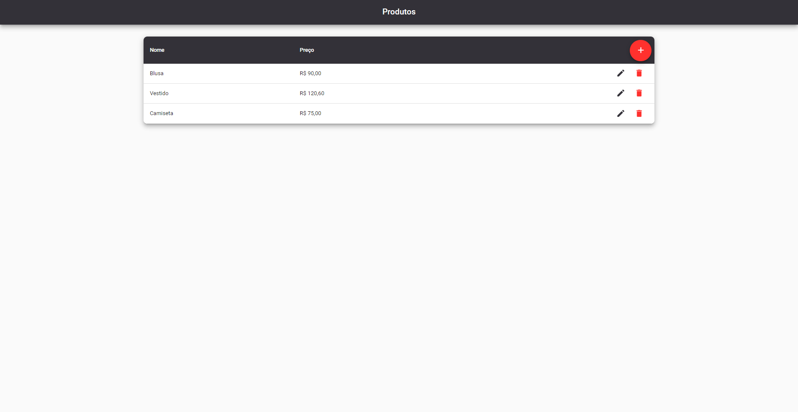

# E-verything

Bem-vindo ao E-verything, este é um experimento para explorar o cadastro e gerenciamento de produtos no universo E-commerce.

**Este repositório é a parte WEB do projeto.** [Clique aqui para ver o repositório da API](https://github.com/Samukaii/e-verything-api)

## Visão Geral

O E-verything é um projeto experimental projetado para testar e explorar diferentes abordagens para o cadastramento e gerenciamento de produtos em lojas online. Este projeto inclui um CRUD simples com opções para criar, deletar, editar e listar produtos, além de uma barra de navegação por breadcrumbs para facilitar a navegação pelo sistema. Além disso, o projeto também é acompanhado por testes unitários para garantir a qualidade do código.

## Recursos Principais

- **Cadastro de Produtos Simples**: Crie novos produtos especificando nome e preço.
- **Edição de Produtos**: Edite facilmente os detalhes de um produto existente.
- **Deleção de Produtos**: Exclua produtos que não são mais necessários.
- **Listagem de Produtos**: Veja todos os produtos cadastrados em uma lista organizada.
- **Barra de Navegação por Breadcrumbs**: Utilize breadcrumbs para navegar facilmente entre as diferentes páginas do sistema.
- **Testes Unitários**: Certifique-se de que o código está funcionando corretamente com testes automatizados.

## Requisitos

- Node versão 18 ou superior

## Instalação

Para começar a usar o E-verything em seu próprio ambiente, siga estas etapas simples:

1. Clone este repositório para o seu ambiente local.
2. Instale as dependências necessárias executando `npm install`.
3. Configure o banco de dados e outras configurações do sistema conforme necessário.
4. Inicie o servidor executando `npm start`.
5. Explore e experimente o E-verything em seu navegador preferido através do endereço local fornecido.

## Demonstração em Vídeo

## Pré-visualização

Por depender de uma API, a pré-visualização na WEB não estará 100% funcional, mas se estiver curioso(a) para ver a web em funcionamento, clique no link abaixo:

[Pré-visualização](https://samukaii.github.io/e-verything/products)

## Contribuição

Se você está interessado em colaborar com o projeto E-verything, sinta-se à vontade para explorar, experimentar e compartilhar suas descobertas. Este projeto é uma oportunidade para aprender e crescer!

## Contato

Para mais informações ou para colaborar no desenvolvimento do projeto, entre em contato através do email samuelalejandro.dev@gmail.com.

Obrigado por participar deste projeto. Estou empolgado para ver o que podemos aprender juntos!
